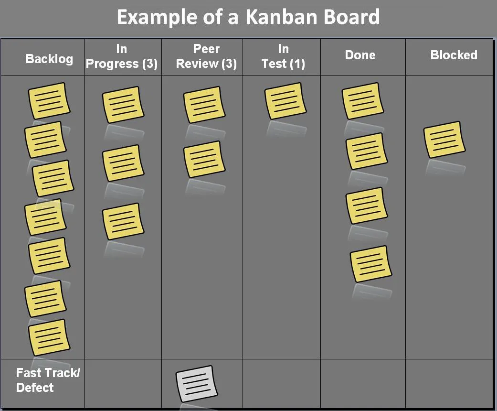

# Kanban

Kanban is a visual method to manage the workflow for individuals, teams, and organizations. Unlike other management methods that force you to follow a strict guideline, Kanban is designed to evolve as your teams requirements does too. It follow with the Agile methodology seamlessly as a result.

If you aren't sure whether or not you could use Kanban, the main aspect of planning that Kanban aids in is anything that follows a repeatable process. If you work follows the pattern of :

- To do
- Doing
- Done

Then it can be managed on a Kanban board.

## What is a Kanban Board

A Kanban board is nothing special, nor is it any one specific thing. You can use it in a physical manner or a digital, whichever works better for your team. In this example, I'll use a physical Kanban board to explain how it is used.

A whiteboard, divided into vertical lanes. Each lane represents a step in your process from "To Do", "Doing", to "Done".

Work begins on the left hand side and you progress to the right. The farthest to left holding any work that has not started, and the farthest right holding work that is complete.

 

## What is a Kanban Card

In Kanban, work items are represented by cards, which can be imagined as notes on a whiteboard.

Each card represents a single work item. In terms of Software Development, this would be a user story, or a piece of work that the team can contain to a single progress point.

Each card should contain all the critical information needed to complete it so whoever takes charge of it will know what they need to do. There should also be an estimate for how long that piece of work will take.

A useful technique is to give each card some points to represent how difficult / how long it will take to finish. This way you can get an estimate for your progress in completing the project by linking it to how much points you have earned and what stage each of them are in.

For example:

- To Do:
  - Contains 3 user stories (cards) each worth 4 points
- Doing:
  - Contains 4 user stories (cards) each worth 6 points
- Done:
  - Contains 2 user stories (cards) one worth 8 points and the other 4 points

With this you are able to quickly see how much more work you need done, how much work you are doing, and how much work you have done without having to describe each task you have finished.

 

## Kanban Sites

Here are some sites you can create your own Kanban board with:

- https://trello.com/en-US
- https://www.zoho.com/projects/
- https://kanbantool.com/

These are all free or have a free tier that will do everything that you need!