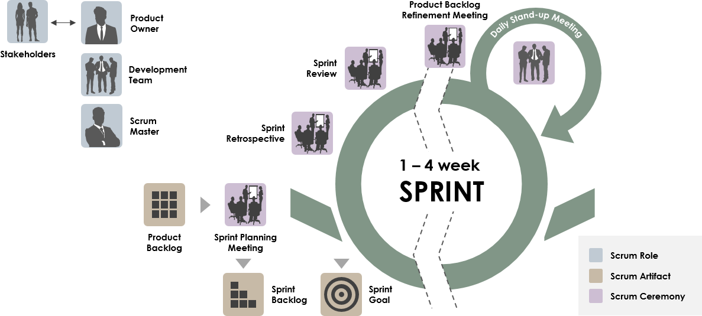

# Scrum

Scrum is a framework that is part of the Agile Methodology to software development. The main emphasis around it, is meetings led by a Scrum leader that ensures Scrum practices are being followed.

Development is broken down into two to four week sprints

Now Scrum is aimed to be used during software development, and the process if fast and efficient, but only if you have experience following it. Within your teams, it is required for you to follow daily Stand-up meetings before your training begins.

## Daily Stand-ups

A stand-up, or also known as "daily scrum" are meetings designed to help set the context for the rest of the day. They are designed to be kept to 15 minute segments and need to be fast and efficient. This keeps discussions short but always relevant.

### Requirements
- Everyone in the team is required to attend and speak
  - Anyone who is not part of the team may show but should only listen
- The meetings are not meant for problem-solving or issue resolution
  - They should be noted and placed on a Kanban board for resolution after the standup
- Each team member must answer the following:
  - What did you do yesterday?
  - What will you do today?
  - Are there any blockers in your way?
    - If a team member says they will complete the database connection in the meeting, tomorrow everyone will expect to hear whether they did or they did not

> Some typical blockers could be:
> - My ____ broke and I need a new one today.
> - I need help debugging a problem with ______.
> - I'm struggling to learn ______ and would like to pair with someone on it.
> - I can't get the ____ group to give me any time and I need to meet with them.

The final requirement is a Scrum Master to lead each standup and ensure that each team member is present and speaking. It should also be their responsibility to resolve the impediments to the best of their ability, and if they cannot then they will work with their team or their manager to help get some resolution.

Typically, the Scrum Master is the leader of the team but that is not set in stone. It is up to you to decide who does what in your team.

## Typical Standup
1. Arrive on time
2. Scrum master speaks first
   1. What did they do yesterday
   2. What did they do today
   3. Are their any blockers in their way
3. Next person in the order
   - If an order has not been established then during the first standup it should be established
4. Once everyone has finished talking, the standup is complete and work can begin